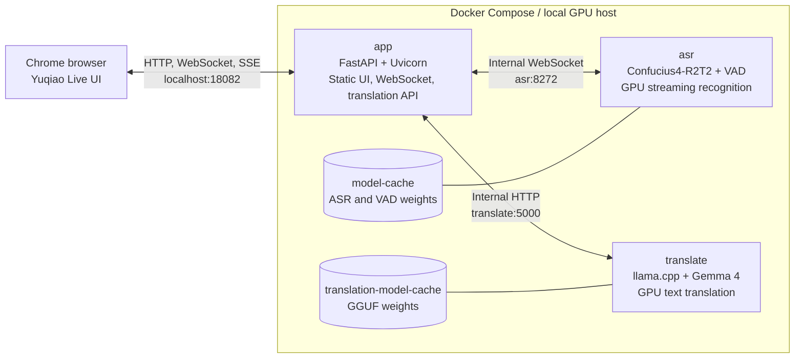
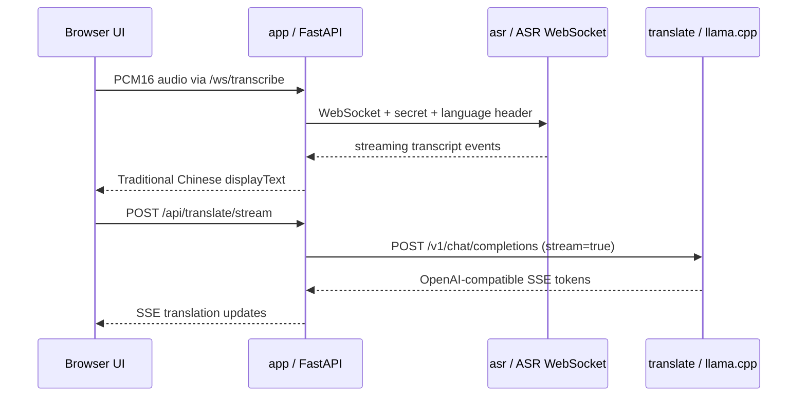
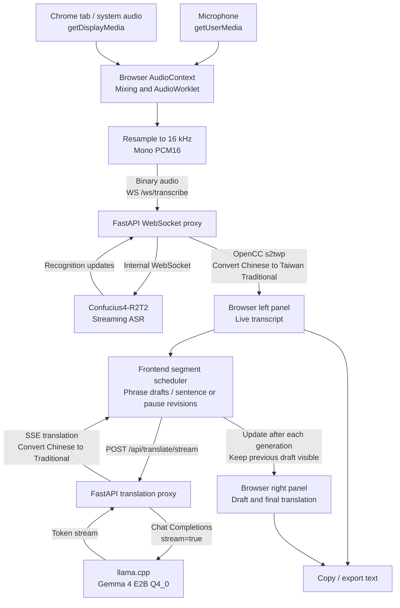

# Yuqiao Live — Real-Time Meeting Transcription and Translation

**Language:** [繁體中文](README.md) | English

Yuqiao Live is a locally hosted web app for real-time meeting transcription and multilingual translation. Capture audio from a microphone, a Chrome tab or system audio, or both. The left panel shows the transcript; the right panel displays a live draft and revises it as a complete sentence when the speaker finishes. It is designed for online meetings, videos, and courses.

The product UI hides the names of the underlying models. This README documents them for development, deployment, and license review: speech recognition uses Confucius4-R2T2, and text translation uses the local Gemma 4 E2B Q4_0 model.

> The first startup downloads Docker images, ASR/VAD models, and Gemma weights. Model caches persist in Docker named volumes. Recognition and translation inference run inside the local Docker network and are not sent to third-party inference APIs. The initial downloads do connect to Hugging Face and other model sources.

## Features

- Live speech transcription, phrase-level translation, transcript copying, and text export.
- Capture from a microphone, Chrome tab/system audio, or both; select an input device and check its audio level before a meeting.
- Select source and target languages, or swap the direction—for example, Japanese to Chinese, Chinese to Japanese, English to Chinese, and Chinese to English.
- Chinese transcripts and translations are displayed in Taiwan Traditional Chinese using OpenCC `s2twp`. Japanese text is not converted.
- Two-column desktop layout and a single-column mobile layout. Add participant names, brands, and terminology as meeting context.
- Switch between light and dark themes. The selection is saved in the current browser.
- Local Docker deployment with no cloud ASR or translation API dependency.

## Technology and service architecture

| Layer | Technology | Responsibility |
| --- | --- | --- |
| Web UI | Native HTML, CSS, JavaScript, MediaDevices, Web Audio API, AudioWorklet | Audio source selection and mixing, 16 kHz PCM encoding, transcript and translation views |
| Web/API | Python 3.12, FastAPI, Uvicorn, WebSocket | Static pages, audio WebSocket proxy, translation API, OpenCC conversion |
| ASR | `qwenllm/qwen3-asr` container + Confucius4-R2T2 | Streaming recognition from 16 kHz mono PCM audio |
| VAD | FireRedVAD Stream-VAD | Voice activity model used by the ASR service |
| Translation | Google Gemma 4 E2B-it QAT Q4_0 GGUF + `llama.cpp` CUDA server | Local multilingual text translation through an OpenAI-compatible Chat Completions API |
| Runtime | Docker Compose, NVIDIA Container Toolkit | Container lifecycle, GPU access, service dependencies, and model caches |

### Deployment topology



Compose defines three services: `app`, `asr`, and `translate`. The ASR and translation services are only available on the Compose network. By default, only the app's host port `18082` is exposed. Two named volumes retain downloaded model weights. The app waits for the other services' health checks before starting.

### Docker images and model-weight downloads

A Docker image is the **runtime environment**; model weights are **model files** loaded by a service. They are downloaded and stored separately:

| Compose service | Docker image / build | How model weights are obtained | Defined in |
| --- | --- | --- | --- |
| `asr` | [`qwenllm/qwen3-asr:latest`](https://hub.docker.com/r/qwenllm/qwen3-asr), the ASR runtime pulled from Docker Hub | When the ASR server starts, it loads `netease-youdao/Confucius4-R2T2` from Hugging Face. The entrypoint separately runs `hf download` for Stream-VAD from `FireRedTeam/FireRedVAD`. | `asr.image` in [`compose.yaml`](compose.yaml); [`docker/asr/entrypoint.sh`](docker/asr/entrypoint.sh) |
| `translate` | [`ghcr.io/ggml-org/llama.cpp:server-cuda`](https://github.com/ggml-org/llama.cpp/pkgs/container/llama.cpp), the CUDA-enabled llama.cpp server pulled from GitHub Container Registry | At startup, llama.cpp downloads the Gemma GGUF from Hugging Face using `--hf-repo` and `--hf-file`. | `translate.image` and `command` in [`compose.yaml`](compose.yaml) |
| `app` | No prebuilt project image. Compose builds it locally with `build: ./webapp`. [`webapp/Dockerfile`](webapp/Dockerfile) uses `python:3.12-slim` as its base and installs `webapp/requirements.txt`. | Does not download or store either model; it runs FastAPI and serves the static web UI. | `app.build` in [`compose.yaml`](compose.yaml); [`webapp/Dockerfile`](webapp/Dockerfile) |

Model caches are separate too: ASR and VAD share `model-cache`, mounted at `/models` in the ASR container; its Hugging Face cache directory is `/models/huggingface`. Gemma uses `translation-model-cache`, mounted at `/root/.cache` in the translation container. A normal `docker compose down` preserves model weights. `docker compose down -v` removes these named volumes.

Compose controls startup: `docker compose up --build -d` prepares or pulls the images, starts `asr` and `translate`, then starts `app` after both model services pass their health checks. ASR, VAD, and Gemma weights are downloaded or loaded on their first container startup; later restarts reuse the cache. See [`compose.yaml`](compose.yaml) for the full image, GPU, command, environment, volume, and health-check configuration.

### Model serving and code connections



- **Start ASR:** [`docker/asr/entrypoint.sh`](docker/asr/entrypoint.sh) installs the project and Hugging Face CLI, checks for and downloads Stream-VAD, then runs [`ws_server.py`](ws_server.py) with `ASR_MODEL_PATH` and `VAD_MODEL_PATH`. The ASR image, environment, mounted paths, and health check are in the `asr` section of [`compose.yaml`](compose.yaml).
- **Start Gemma:** `translate.command` in `compose.yaml` starts the llama.cpp server. `--hf-repo` and `--hf-file` select the weights; `--port 5000` exposes the service on the Compose network. GPU offload, context size, parallelism, and the model cache are configured in the same `translate` section.
- **Connect audio to ASR:** [`webapp/static/app.js`](webapp/static/app.js) converts browser audio to PCM16 and sends it to `/ws/transcribe`. The `transcribe()` handler in [`webapp/server.py`](webapp/server.py) accepts the browser WebSocket, then connects to ASR through `ASR_WS_URL` (set in Compose to `ws://asr:8272/asr_stream_api_v1`) and relays audio and recognition events. FastAPI adds `ASR_SECRET_KEY` and language settings, then uses OpenCC to produce Traditional Chinese display text.
- **Connect the transcript to translation:** `runTranslation()` in `app.js` calls `/api/translate/stream`. `translate_stream()` and `translation_payload()` in `server.py` use `httpx` to call `/v1/chat/completions` at `TRANSLATE_URL` (set in Compose to `http://translate:5000`) and relay the SSE stream. `TRANSLATE_MODEL` provides the model file name sent in the request.
- **Start the web UI:** [`webapp/Dockerfile`](webapp/Dockerfile) builds the Python/FastAPI app image. Compose mounts local `./webapp` at `/app` in the container; Uvicorn starts the `app` object in `webapp/server.py` and serves the static files. The host browser opens `http://localhost:18082`; it never connects directly to ASR or llama.cpp.

### Meeting data flow



1. After user permission, the browser captures audio. Mixed mode combines both inputs. AudioWorklet processes samples, and the frontend converts them to 16 kHz mono PCM16 before sending them through `/ws/transcribe`. When screen sharing is used, only its audio track enters this flow; video is not processed.
2. FastAPI opens an internal WebSocket to ASR, adds the service key and language settings, and relays recognition updates to the browser. Chinese display text is converted to Taiwan Traditional Chinese on the server with OpenCC `s2twp`; the raw recognition text is not rewritten.
3. The frontend requests draft translations on a fixed cadence as phrases arrive. Punctuation, a pause of about 1.8 seconds, an overlong segment, or the end of a meeting triggers a complete-sentence revision. The translation proxy sends an OpenAI-compatible request to `llama.cpp` and wraps the model's token stream in SSE.
4. The frontend collects each SSE response and updates the right panel only after that generation finishes. The previous translation remains visible during a revision, and the UI is not rebuilt for every token. Auto-scroll follows only when the user was already near the bottom. Copy and export use the currently visible transcript and translation.

### Key files

| Path | Responsibility |
| --- | --- |
| [`compose.yaml`](compose.yaml) | Services, GPU access, health checks, ports, and model-cache volumes |
| [`docker/asr/entrypoint.sh`](docker/asr/entrypoint.sh) | Prepare VAD weights and start streaming ASR |
| [`ws_server.py`](ws_server.py), [`r2t2/`](r2t2), [`pyproject.toml`](pyproject.toml) | ASR WebSocket server, recognition model interface, and container installation config; derived from upstream |
| [`webapp/server.py`](webapp/server.py) | FastAPI routes, ASR WebSocket proxy, translation API, and Traditional Chinese conversion |
| [`webapp/static/app.js`](webapp/static/app.js) | Audio capture, PCM streaming, translation scheduling, and UI state |
| [`webapp/static/pcm-worklet.js`](webapp/static/pcm-worklet.js) | Browser audio sampling processor |
| [`webapp/static/index.html`](webapp/static/index.html) and CSS | Yuqiao Live UI, themes, and two-panel layout |
| [`webapp/test_server.py`](webapp/test_server.py), [`smoke_test.py`](smoke_test.py) | API/proxy unit tests and a WebSocket audio smoke test |

### Repository scope and upstream attribution

This repository contains only the files needed to run, deploy, and test Yuqiao Live. The ASR files `ws_server.py`, `r2t2/`, and `pyproject.toml` are derived from [Netease Youdao's original Confucius4-R2T2 project](https://github.com/netease-youdao/Confucius4-R2T2). Its source-code license is retained in [`LICENSE`](LICENSE). Unused upstream examples, `r2t2_llama/`, test resources, and large binaries are not included here; consult the upstream project for those files. `r2t2_llama/` is an optional upstream ASR backend; Gemma translation in this project is served separately by the llama.cpp Docker image.

Neither the ASR nor translation model weights are uploaded to this repository; their containers download them at deployment time. Before using the ASR model, also review the [Confucius4-R2T2 model card](https://huggingface.co/netease-youdao/Confucius4-R2T2) and [upstream model license](https://github.com/netease-youdao/Confucius4-R2T2/blob/master/MODEL_LICENSE).

## Models and language coverage

### Confucius4-R2T2: speech recognition

The project uses [Confucius4-R2T2 from Netease Youdao](https://huggingface.co/netease-youdao/Confucius4-R2T2), based on the Qwen3-ASR architecture and optimized for real-time Chinese and English recognition. Its model card also lists Japanese, Korean, French, German, Italian, Portuguese, Russian, Spanish, and Arabic. The project does not guarantee equal quality for every language and direction offered in the UI.

The UI also offers Cantonese, Indonesian, Thai, Vietnamese, Turkish, Hindi, Malay, Dutch, Swedish, Danish, Finnish, Polish, Czech, Filipino, Persian, Greek, Romanian, Hungarian, and Macedonian as experimental options. These are language prompts accepted by the current ASR service interface; their recognition quality has not been validated by this project or guaranteed by Confucius4-R2T2.

The “Chinese/English auto-detect” option targets the product's primary Chinese and English use cases. Select other source languages explicitly. Translation offers the same language list, but Gemma 4's “35+ languages out of the box” does not mean every listed language pair has been validated here. Test low-resource languages, mixed-language speech, proper nouns, and very short segments with real meeting audio.

### Gemma 4 E2B-it QAT Q4_0: text translation

The project uses `gemma-4-E2B_q4_0-it.gguf` from Google's [Gemma 4 E2B-it quantized GGUF repository](https://huggingface.co/google/gemma-4-E2B-it-qat-q4_0-gguf). It is an instruction-tuned text-generation model quantized with QAT Q4_0. The GGUF weights are about **3.35 GB**. The full repository is about **4.34 GB** and also includes a roughly 987 MB multimodal projector. This project translates text only, so it uses `--no-mmproj` to skip that projector. Actual GPU use also includes the CUDA runtime, KV cache, context, and ASR workload; it is not equal to the weight-file size alone.

Gemma 4 handles **text translation after transcription**; Confucius4-R2T2 handles speech recognition. The model receives source and target languages, the current segment, and a small amount of recent translation context, and is instructed to return only the translation. Short segments usually return faster. Full-sentence quality and latency depend on the GPU, ASR segmentation, and utterance length. E2B Q4 was chosen to reduce resource use and waiting time for a single-person meeting. A larger model may improve translation quality but requires more VRAM and may increase latency.

## Serving Gemma 4

The project starts Gemma with the [`llama.cpp` CUDA server image](https://github.com/ggml-org/llama.cpp/blob/master/tools/server/README.md). The main settings are in the `translate` service in [`compose.yaml`](compose.yaml):

```yaml
image: ghcr.io/ggml-org/llama.cpp:server-cuda
gpus: all
command:
  - --hf-repo
  - google/gemma-4-E2B-it-qat-q4_0-gguf
  - --hf-file
  - gemma-4-E2B_q4_0-it.gguf
  - --host
  - 0.0.0.0
  - --port
  - "5000"
  - --n-gpu-layers
  - "99"
  - --ctx-size
  - "3072"
  - --parallel
  - "1"
  - --flash-attn
  - on
  - --no-mmproj
  - --reasoning
  - "off"
  - --no-webui
volumes:
  - translation-model-cache:/root/.cache
```

On the first Compose startup, `llama.cpp` downloads the specified repository and GGUF into `translation-model-cache`, then loads the model on the GPU. `--hf-file` pins the Q4_0 weights instead of choosing another quantization automatically. `--n-gpu-layers 99` attempts to offload all model layers to the GPU. `--ctx-size 3072` and `--parallel 1` target one meeting/request at a time. `--no-mmproj` skips the unused multimodal projector, and `--reasoning off` prevents extra reasoning text before the translation. Compose includes the translation service health check in the app's startup dependencies.

The defaults can be overridden in `.env`:

```dotenv
TRANSLATE_MODEL_REPO=google/gemma-4-E2B-it-qat-q4_0-gguf
TRANSLATE_MODEL_FILE=gemma-4-E2B_q4_0-it.gguf
```

Equivalent standalone Docker command (Compose is recommended to keep the same CUDA image, GPU access, and persistent model cache):

```bash
docker run --rm --gpus all -p 5000:5000 \
  -v gemma4-cache:/root/.cache \
  ghcr.io/ggml-org/llama.cpp:server-cuda \
  --hf-repo google/gemma-4-E2B-it-qat-q4_0-gguf \
  --hf-file gemma-4-E2B_q4_0-it.gguf \
  --host 0.0.0.0 --port 5000 \
  --n-gpu-layers 99 --ctx-size 3072 --parallel 1 \
  --flash-attn on --no-mmproj --reasoning off --no-webui
```

`llama.cpp` exposes an OpenAI-compatible `POST /v1/chat/completions`. The FastAPI service calls it through `TRANSLATE_URL=http://translate:5000`; the browser UI never connects directly to the model server.

## Requirements

- Windows 11 with WSL2 or Linux, Docker Desktop / Docker Engine, and Docker Compose v2.
- An NVIDIA GPU and Docker GPU support through NVIDIA Container Toolkit. Compose uses `gpus: all`; ASR and Gemma share the visible GPU.
- Enough VRAM and system memory. `GPU_MEMORY_UTILIZATION=0.40` in `.env.example` is the fraction of GPU memory vLLM may configure for ASR, not a reservation for the entire GPU. Translation uses additional VRAM. First-time downloads require access to the Docker registry and Hugging Face and several gigabytes of disk space.
- A recent version of Chrome is recommended for microphone or system-audio capture. Browser capture requires a secure origin such as `localhost` or HTTPS, and the user must select and authorize the source in the browser dialog.

## Quick start

From the project root in PowerShell:

```powershell
Copy-Item .env.example .env
```

Set `ASR_SECRET_KEY` in `.env` to a long, randomly generated value, then start the services:

```powershell
docker compose up --build -d
docker compose ps
docker compose logs -f asr translate app
```

The first run downloads container images, ASR weights, FireRedVAD Stream-VAD, and the Gemma GGUF. Wait for the `asr` and `translate` health checks to pass, then open [http://localhost:18082](http://localhost:18082). If you changed `APP_PORT` in `.env`, use that port instead. Press `Ctrl+C` to stop following logs; the services continue running in the background.

## Using it in a meeting

1. Choose a **Source language** and **Translate to** language. Select the source explicitly when known. Use the swap button to change directions, such as Chinese ↔ English or Japanese ↔ Chinese.
2. Choose an audio source:
   - **Microphone:** Select an input device, such as a USB microphone or MDR headset microphone. Click **Test audio source** and speak to confirm the level meter responds.
   - **Tab / system audio:** Chrome opens a sharing dialog after you start. For YouTube, select the video tab and enable **Share tab audio**. For desktop meetings, select a screen and enable the system-audio option if Chrome offers it.
   - **Microphone + system audio:** Capture computer audio and your own voice together. A headset helps prevent speaker feedback.
3. Enter participant names, company, product, or other terminology in **Meeting context** to help recognition with proper nouns.
4. Test the source, then click **Start meeting**. The transcript appears on the left. A draft translation appears on the right and is revised as a complete sentence at punctuation, after a pause of about 1.8 seconds, or when the meeting ends. Draft translations can change. Use the bottom controls to copy or export the visible text.

System audio is captured with the browser's `getDisplayMedia()` sharing dialog. Chrome requires the user to choose a tab or screen and explicitly share audio. If the dialog does not provide an audio track, select a tab that can share audio or make the selection again. When screen sharing returns a video track, this app connects only the audio to the transcription flow; it does not upload screen video. Ending the meeting closes the audio streams. The app does not record or retain raw audio.

## Configuration reference

| `.env` variable | Default | Description |
| --- | --- | --- |
| `APP_PORT` | `18082` | Host port for the web app/API; container port is fixed at 8080 |
| `ASR_MODEL_PATH` | `netease-youdao/Confucius4-R2T2` | ASR Hugging Face repository or compatible model path |
| `ASR_SECRET_KEY` | Set your own | Service key shared between app and ASR; do not use the default for shared or public deployments |
| `GPU_MEMORY_UTILIZATION` | `0.40` | Fraction of GPU memory vLLM may configure for ASR; Gemma uses additional GPU memory |
| `ASR_MAX_MODEL_LEN` | `16384` | Maximum model length configured for ASR vLLM |
| `CUDA_VISIBLE_DEVICES` | `0` | GPU device index visible inside the containers |
| `TRANSLATE_MODEL_REPO` | Google QAT Q4_0 GGUF repository | Model repository downloaded by `llama.cpp` |
| `TRANSLATE_MODEL_FILE` | `gemma-4-E2B_q4_0-it.gguf` | GGUF weight file in the repository |

Copy [`.env.example`](.env.example) to `.env` and edit it. Never commit `.env` with a real secret.

## Service endpoints

| Endpoint | Purpose |
| --- | --- |
| `GET /` | Meeting web app |
| `GET /api/health` | Basic FastAPI health check |
| `WS /ws/transcribe` | Browser-to-app real-time PCM audio WebSocket |
| `POST /api/translate` | Translate text; JSON fields: `text`, `source`, `target`, and optional `history` |
| `POST /api/translate/stream` | Streaming translation; same fields plus optional `draft`; returns SSE `data: {"text":"...","done":false}` and ends with `done=true` |
| ASR `ws://asr:8272/asr_stream_api_v1` | Internal endpoint available only to the app on the Compose network |
| llama.cpp `http://translate:5000/v1/chat/completions` | Internal endpoint available only to the app on the Compose network |

### Translation API example

```powershell
$body = @{ text = "この会議を翻訳します。"; source = "ja"; target = "zh" } | ConvertTo-Json
Invoke-RestMethod -Method Post -Uri http://localhost:18082/api/translate -ContentType 'application/json' -Body $body
```

## Verification and maintenance

Check health and logs:

```powershell
Invoke-RestMethod http://localhost:18082/api/health
docker compose ps
docker compose logs --tail 100 app asr translate
```

Run the FastAPI proxy unit tests:

```powershell
docker compose exec -T app python -m unittest -v test_server
```

Run the local WAV WebSocket smoke test (requires the project Python environment, the `websockets` package, and your own 16 kHz mono 16-bit PCM WAV):

```powershell
python smoke_test.py --audio C:\path\to\sample-16k-mono.wav
```

Common container commands:

```powershell
docker compose restart app
docker compose down
```

`docker compose down` stops and removes containers but **keeps** the ASR and translation model caches. `docker compose down -v` deletes the named volumes; the models must be downloaded again on the next startup. Use it only when you intend to clear the model caches.

## Troubleshooting

- **Services take a long time to become healthy:** The first startup downloads large weights. Check `docker compose logs -f asr translate`, confirm Hugging Face is reachable and disk space is available, then inspect `docker compose ps`.
- **GPU out of memory:** ASR and Gemma share the GPU. Check for other GPU workloads, lower `GPU_MEMORY_UTILIZATION`, reduce the ASR maximum model length or translation context, and avoid running other large models at the same time. A smaller ASR allocation can reduce its memory use but may affect throughput.
- **Chrome cannot find the microphone or the device list is empty:** Allow microphone access in the address bar's site permissions and reload the page. Check that the Windows input device is enabled and select the MDR microphone in the app. Bluetooth MDR headsets may expose one or more input endpoints. Use the audio-level test to confirm the browser receives a signal.
- **No YouTube or meeting audio:** Explicitly enable tab audio or system audio in Chrome's sharing dialog. Sharing the screen alone does not provide audio. Available options depend on the OS and Chrome version. Test with **Tab / system audio** in the source selector.
- **Transcription is delayed or phrases are incomplete:** ASR segmentation and inference time affect when text arrives. A draft translation is requested about 250 ms after a phrase starts forming and updates only when the generation finishes. Punctuation, a pause of about 1.8 seconds, or an overlong segment triggers a complete-sentence revision. The previous readable translation stays visible during a revision, and only one translation request runs per meeting. Background noise, very short utterances, and overlapping speakers can reduce quality.
- **Translation does not update:** Check `docker compose logs -f translate app` and confirm the `translate` health check passed. Start by testing common directions such as Chinese/English or Japanese/Chinese, then investigate experimental languages.
- **The old CSS or JavaScript is still displayed:** Hard-refresh the browser with `Ctrl+Shift+R`. Static asset URLs include version parameters to avoid stale browser cache.

## Privacy and licenses

This app has no sign-in or multi-user isolation and should be used on a trusted local network by default. Before exposing it to other devices or the internet, add HTTPS, authentication, and appropriate network access controls. Model startup downloads connect to external registries and Hugging Face; inference requests stay inside the local Docker network. Review the licenses for the ASR model, Gemma 4, `llama.cpp`, and dependencies before use. The Gemma 4 QAT repository model card lists Apache-2.0; check the license distributed with the downloaded files.

## References

- [Confucius4-R2T2 model card](https://huggingface.co/netease-youdao/Confucius4-R2T2)
- [Google Gemma 4 E2B-it model card](https://huggingface.co/google/gemma-4-E2B-it)
- [Google Gemma 4 E2B-it QAT Q4_0 GGUF repository](https://huggingface.co/google/gemma-4-E2B-it-qat-q4_0-gguf)
- [`llama.cpp` server documentation](https://github.com/ggml-org/llama.cpp/blob/master/tools/server/README.md)
- [MDN: `getDisplayMedia()`](https://developer.mozilla.org/en-US/docs/Web/API/MediaDevices/getDisplayMedia)
- [Upstream Confucius4-R2T2 README (Simplified Chinese)](https://github.com/netease-youdao/Confucius4-R2T2/blob/master/README.zh.md)
