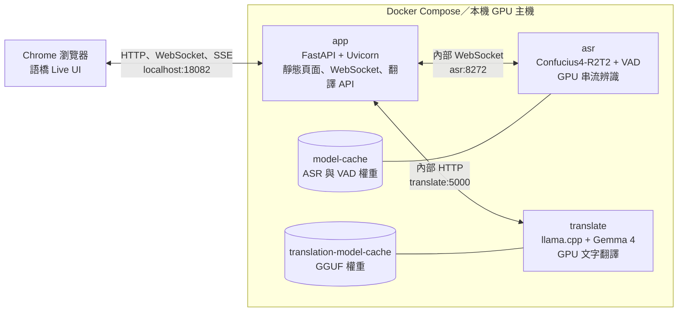
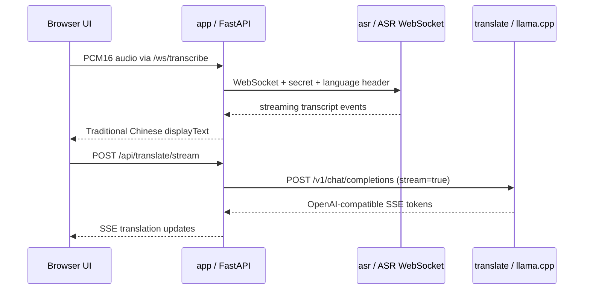
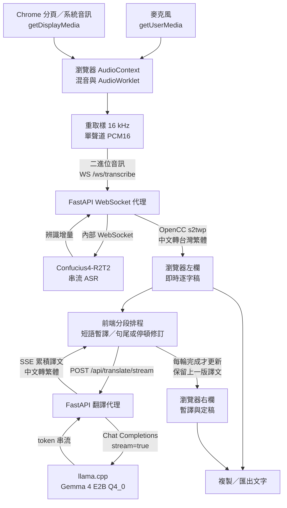

# 語橋 Live — 即時會議逐字稿與翻譯

**Language:** 繁體中文 | [English](README.en.md)

語橋 Live 是本機部署的即時會議轉錄與跨語翻譯 Web App。使用者可從麥克風、Chrome 分頁／系統聲音或兩者混合收音；左欄顯示逐字稿，右欄先顯示暫譯，語句完成後再以完整句修訂。適合單人參與線上會議、觀看影片及線上課程時使用。

產品 UI 不顯示底層模型名稱；本 README 保留模型、框架與部署細節，供維護、驗證與授權檢查。語音辨識使用 Confucius4-R2T2，文字翻譯使用本機 Gemma 4 E2B Q4_0。

> 第一次啟動需要下載 Docker image、ASR/VAD 模型與 Gemma 權重；下載後模型快取會保留在 Docker named volumes。辨識與翻譯請求在本機 Docker 網路中處理，不會送到第三方推論 API。首次下載仍會連到 Hugging Face 等模型來源。

## 功能一覽

- 即時語音逐字稿、分段即時翻譯、逐字稿複製與文字檔匯出。
- 來源可選麥克風、Chrome 分頁／系統音訊，或兩者混合；可選輸入裝置並先看音量測試。
- 可選來源語言與目標語言，也可交換方向，例如日→中、中→日、英→中、中→英。
- 中文辨識及中文翻譯顯示為台灣繁體；原模型文字由 OpenCC `s2twp` 轉換，日文文字不會被轉換。
- 雙欄桌面版和直向手機版；可調整會議情境提示，提供姓名、品牌或專有名詞。
- 右上角可切換明亮／暗色主題，選擇會保存在目前瀏覽器。
- 本機 Docker 部署，不依賴雲端 ASR 或翻譯 API。

## 技術與服務架構

| 層 | 技術 | 用途 |
| --- | --- | --- |
| Web UI | 原生 HTML、CSS、JavaScript、MediaDevices、Web Audio API、AudioWorklet | 音源選擇、混音、16 kHz PCM 編碼、雙欄逐字稿與翻譯呈現 |
| Web/API | Python 3.12、FastAPI、Uvicorn、WebSocket | 靜態頁面、音訊 WebSocket 代理、翻譯 API、OpenCC 繁體轉換 |
| ASR | `qwenllm/qwen3-asr` 容器 + Confucius4-R2T2 | 以 16 kHz、單聲道 PCM 音訊串流辨識 |
| VAD | FireRedVAD Stream-VAD | ASR 服務端語音活動處理所需模型 |
| 翻譯 | Google Gemma 4 E2B-it QAT Q4_0 GGUF + `llama.cpp` CUDA server | 本機、多語文字翻譯；透過 OpenAI 相容 Chat Completions API 呼叫 |
| 執行環境 | Docker Compose、NVIDIA Container Toolkit | 管理容器、GPU、服務依賴與模型快取 |

### 部署拓樸



Compose 定義 `app`、`asr`、`translate` 三個服務。`asr` 與 `translate` 僅在 Compose 內網提供服務，預設只有 `app` 的主機連接埠 `18082` 對外映射；兩個 named volume 保留下載的權重。`app` 啟動時會等待另兩個服務的健康檢查通過。

### Docker image 與模型權重分別下載在哪裡

Docker image 是「執行環境」，模型權重是服務啟動時載入的「模型檔」；兩者分開下載並存放：

| Compose 服務 | Docker image / 建置方式 | 模型權重如何取得 | 定義位置 |
| --- | --- | --- | --- |
| `asr` | [`qwenllm/qwen3-asr:latest`](https://hub.docker.com/r/qwenllm/qwen3-asr)，由 Docker Hub 下載 ASR 執行環境 | 啟動 ASR server 時載入 Hugging Face 上的 `netease-youdao/Confucius4-R2T2`；entrypoint 另以 `hf download` 下載 `FireRedTeam/FireRedVAD` 的 Stream-VAD | [`compose.yaml`](compose.yaml) 的 `asr.image`；[`docker/asr/entrypoint.sh`](docker/asr/entrypoint.sh) |
| `translate` | [`ghcr.io/ggml-org/llama.cpp:server-cuda`](https://github.com/ggml-org/llama.cpp/pkgs/container/llama.cpp)，由 GitHub Container Registry 下載含 CUDA 的 llama.cpp server | llama.cpp 啟動時依 `--hf-repo`、`--hf-file` 從 Hugging Face 下載 Gemma GGUF | [`compose.yaml`](compose.yaml) 的 `translate.image` 與 `command` |
| `app` | 不使用預先發佈的專案 image；Compose 由 `build: ./webapp` 本機建置。[`webapp/Dockerfile`](webapp/Dockerfile) 以 `python:3.12-slim` 為基底，安裝 `webapp/requirements.txt` | 不下載或保存 ASR／翻譯模型；執行 FastAPI 與靜態 Web UI | [`compose.yaml`](compose.yaml) 的 `app.build`、[`webapp/Dockerfile`](webapp/Dockerfile) |

模型快取位置也分開：ASR 與 VAD 共用 `model-cache`，掛載到 ASR 容器的 `/models`，Hugging Face 快取目錄是 `/models/huggingface`；Gemma 權重使用 `translation-model-cache`，掛載至翻譯容器的 `/root/.cache`。因此一般執行 `docker compose down` 後仍會保留模型；只有 `docker compose down -v` 才會刪除這些 named volumes。

啟動順序由 Compose 管理：`docker compose up --build -d` 先準備／下載 images，啟動 `asr` 與 `translate`，兩者健康檢查成功後才啟動 `app`。ASR、VAD、Gemma 權重會在各自容器第一次啟動時下載或載入，日後重啟會使用快取。可在 [`compose.yaml`](compose.yaml) 查看 image、GPU、命令、環境變數、volume 與健康檢查的完整設定。

### 模型 serve 與程式串接位置



- **ASR 啟動：** [`docker/asr/entrypoint.sh`](docker/asr/entrypoint.sh) 安裝專案與 Hugging Face CLI、檢查並下載 Stream-VAD，最後執行 [`ws_server.py`](ws_server.py)，並把 `ASR_MODEL_PATH` 與 `VAD_MODEL_PATH` 傳入。ASR image、環境變數、掛載路徑與健康檢查位於 [`compose.yaml`](compose.yaml) 的 `asr` 區塊。
- **Gemma 啟動：** `compose.yaml` 的 `translate.command` 啟動 llama.cpp server，`--hf-repo` 和 `--hf-file` 指定權重，`--port 5000` 在 Compose 內網提供服務。Gemma 的 GPU offload、context、parallel 與模型快取設定也都在同一個 `translate` 區塊。
- **音訊接到 ASR：** [`webapp/static/app.js`](webapp/static/app.js) 將瀏覽器音訊轉為 PCM16 並連至 `/ws/transcribe`；[`webapp/server.py`](webapp/server.py) 的 `transcribe()` 讀取瀏覽器 WebSocket，再透過 `ASR_WS_URL`（Compose 設為 `ws://asr:8272/asr_stream_api_v1`）連進 ASR 容器，轉送音訊與辨識事件。FastAPI 會加入 `ASR_SECRET_KEY` 及語言設定，並用 OpenCC 產生繁體顯示文字。
- **逐字稿接到翻譯：** `app.js` 的 `runTranslation()` 呼叫 `/api/translate/stream`；`server.py` 的 `translate_stream()` 與 `translation_payload()` 透過 `httpx` 呼叫 `TRANSLATE_URL`（Compose 設為 `http://translate:5000`）上的 `/v1/chat/completions`，逐段轉送 SSE。模型權重檔名稱則由 `TRANSLATE_MODEL` 提供。
- **Web UI 啟動：** [`webapp/Dockerfile`](webapp/Dockerfile) 建置 Python/FastAPI app image。Compose 將本機 `./webapp` 掛載到容器 `/app`；Uvicorn 以 `webapp/server.py` 的 `app` 啟動並服務靜態頁面。主機瀏覽器使用 `http://localhost:18082`，不會直接連到 ASR 或 llama.cpp。

### 會議資料流



1. 瀏覽器經使用者授權取得音訊；混合模式將兩路音訊合成。AudioWorklet 取樣，前端轉成 16 kHz 單聲道 PCM16，再透過 `/ws/transcribe` 傳送。分享畫面時只讀取音訊軌，影像不進入此資料流。
2. FastAPI 為 ASR 建立內部 WebSocket、加上服務密鑰與語言設定，並將辨識增量回送瀏覽器。中文顯示文字在服務端以 OpenCC `s2twp` 轉為台灣繁體；辨識原文不因此改寫。
3. 前端依固定節奏對新增短語要求暫譯；遇句尾標點、約 1.8 秒停頓、過長語段或結束會議時，要求完整句修訂。翻譯代理以 OpenAI 相容請求呼叫 llama.cpp，將模型 token 串流包成 SSE 回傳。
4. 前端累積每輪 SSE，完成後才原位替換右欄暫譯；修訂期間保留上一版，不逐 token 重建畫面。只有使用者原本在右欄底部附近時才自動跟隨捲動。複製與匯出使用當下可見的逐字稿與譯文。

### 主要檔案

| 路徑 | 職責 |
| --- | --- |
| [`compose.yaml`](compose.yaml) | 三個服務、GPU、健康檢查、port 與模型快取 volume |
| [`docker/asr/entrypoint.sh`](docker/asr/entrypoint.sh) | 準備 VAD 權重並啟動串流 ASR |
| [`ws_server.py`](ws_server.py)、[`r2t2/`](r2t2)、[`pyproject.toml`](pyproject.toml) | ASR WebSocket 服務、辨識模型介面與容器內安裝設定；沿用並調整自上游專案 |
| [`webapp/server.py`](webapp/server.py) | FastAPI 路由、ASR WebSocket 代理、翻譯 API 與繁體轉換 |
| [`webapp/static/app.js`](webapp/static/app.js) | 音源擷取、PCM 串流、翻譯分段排程及畫面狀態 |
| [`webapp/static/pcm-worklet.js`](webapp/static/pcm-worklet.js) | 瀏覽器音訊取樣處理器 |
| [`webapp/static/index.html`](webapp/static/index.html) 與 CSS | 語橋 Live 介面、深淺主題與雙欄排版 |
| [`webapp/test_server.py`](webapp/test_server.py)、[`smoke_test.py`](smoke_test.py) | API／代理單元測試與真實 WebSocket 音訊冒煙測試 |

### 專案範圍與上游來源

此 repo 只保留語橋 Live 執行、部署與測試所需的檔案。ASR 部分的 `ws_server.py`、`r2t2/` 與 `pyproject.toml` 來自並改作自 [Netease Youdao 的 Confucius4-R2T2 原始專案](https://github.com/netease-youdao/Confucius4-R2T2)；原始碼授權文件保留在 [`LICENSE`](LICENSE)。未使用的上游範例、`r2t2_llama/`、測試資源與大型二進位檔不收錄於此，請到上游專案查看。`r2t2_llama/` 是上游可選的 ASR 後端；本專案的 Gemma 翻譯另由 llama.cpp Docker image 提供，兩者不要混淆。

ASR 與翻譯模型權重均未上傳此 repo，部署時由各自容器下載。使用模型前請另外查閱 [Confucius4-R2T2 模型卡](https://huggingface.co/netease-youdao/Confucius4-R2T2)及[上游模型授權條款](https://github.com/netease-youdao/Confucius4-R2T2/blob/master/MODEL_LICENSE)。

## 模型介紹與語言範圍

### Confucius4-R2T2：語音辨識

使用 [Netease Youdao 的 Confucius4-R2T2](https://huggingface.co/netease-youdao/Confucius4-R2T2)，以 Qwen3-ASR 架構為基礎，針對中文和英文即時辨識最佳化。模型卡亦列舉日文、韓文、法文、德文、義大利文、葡萄牙文、俄文、西班牙文、阿拉伯文等語言。官方沒有在此專案中對 UI 列出的每一個語言／方向組合提供同等品質保證。

網頁另外提供粵語、印尼文、泰文、越南文、土耳其文、印度文、馬來文、荷蘭文、瑞典文、丹麥文、芬蘭文、波蘭文、捷克文、菲律賓文、波斯文、希臘文、羅馬尼亞文、匈牙利文和馬其頓文等選項，並標示為實驗性。這些是目前 ASR 服務介面可接受的語言提示，不代表 Confucius4-R2T2 或本專案已針對它們驗證辨識品質。

來源選單的「中英自動偵測」涵蓋此產品主要優化的中英文使用情境；其他語言建議明確指定來源。翻譯模型選單採相同語言清單，但 Gemma 4 的「35+ 種開箱支援語言」不等於所有選單語言和方向都經本專案品質驗證。低資源語言、混合語句、專有名詞與很短的片段尤其要用實際會議內容確認。

### Gemma 4 E2B-it QAT Q4_0：文字翻譯

採用 Google 發佈的 [Gemma 4 E2B-it 量化 GGUF repo](https://huggingface.co/google/gemma-4-E2B-it-qat-q4_0-gguf) 中 `gemma-4-E2B_q4_0-it.gguf`，是一個 instruction-tuned、以 QAT Q4_0 量化的文字生成模型。GGUF 權重大約 **3.35 GB**；整個 repo 約 **4.34 GB**，另含約 987 MB 的多模態 projector。本專案只做文字翻譯，透過 `--no-mmproj` 不載入 projector。實際 GPU 使用量會再包含 CUDA runtime、KV cache、上下文和 ASR，並非只等於權重檔大小。

Gemma 4 在本專案負責**逐字稿後的文字翻譯**；語音辨識由 Confucius4-R2T2 負責。模型會收到來源／目標語言、目前語句，以及最近少量翻譯上下文，並被要求只回傳譯文。短片段通常較快出結果，完整句子的翻譯品質與延遲則受 GPU、ASR 分段時機和語句長度影響。選用 E2B Q4 是為了降低單人會議的資源占用和等待；若需要更高翻譯品質，可以換大模型，但需要更多 VRAM，延遲也可能上升。

## Gemma 4 如何 serve

本專案以 [`llama.cpp` CUDA server image](https://github.com/ggml-org/llama.cpp/blob/master/tools/server/README.md) 啟動 Gemma。主要設定位於 [`compose.yaml`](compose.yaml) 的 `translate` service：

```yaml
image: ghcr.io/ggml-org/llama.cpp:server-cuda
gpus: all
command:
  - --hf-repo
  - google/gemma-4-E2B-it-qat-q4_0-gguf
  - --hf-file
  - gemma-4-E2B_q4_0-it.gguf
  - --host
  - 0.0.0.0
  - --port
  - "5000"
  - --n-gpu-layers
  - "99"
  - --ctx-size
  - "3072"
  - --parallel
  - "1"
  - --flash-attn
  - on
  - --no-mmproj
  - --reasoning
  - "off"
  - --no-webui
volumes:
  - translation-model-cache:/root/.cache
```

第一次 Compose 啟動時，llama.cpp 會從 Hugging Face 下載指定 repo 與 GGUF 到 `translation-model-cache`，再在 GPU 上載入。`--hf-file` 明確指定 Q4_0 權重檔，避免自動挑到另一個量化；`--n-gpu-layers 99` 嘗試把模型層 offload 到 GPU；`--ctx-size 3072` 和 `--parallel 1` 將服務設定在單一會議／單一請求的使用情境；`--no-mmproj` 不載入不需要的多模態投影器；`--reasoning off` 避免翻譯前額外輸出推理文字。Compose 會把翻譯服務的健康檢查納入 app 啟動依賴。

Compose 將目前預設值抽成環境變數，可在 `.env` 指定不同的 repo 或檔案：

```dotenv
TRANSLATE_MODEL_REPO=google/gemma-4-E2B-it-qat-q4_0-gguf
TRANSLATE_MODEL_FILE=gemma-4-E2B_q4_0-it.gguf
```

若單獨啟動 llama.cpp（不經 Compose），等價的基本命令如下；要載入相同 CUDA image、使用 GPU 及保留模型快取，請使用 Docker 版本：

```bash
docker run --rm --gpus all -p 5000:5000 \
  -v gemma4-cache:/root/.cache \
  ghcr.io/ggml-org/llama.cpp:server-cuda \
  --hf-repo google/gemma-4-E2B-it-qat-q4_0-gguf \
  --hf-file gemma-4-E2B_q4_0-it.gguf \
  --host 0.0.0.0 --port 5000 \
  --n-gpu-layers 99 --ctx-size 3072 --parallel 1 \
  --flash-attn on --no-mmproj --reasoning off --no-webui
```

llama.cpp 提供 OpenAI 相容的 `POST /v1/chat/completions`。本專案的 FastAPI 服務會以 `TRANSLATE_URL=http://translate:5000` 呼叫它；UI 不會直接連到模型服務。

## 系統需求

- Windows 11/WSL2 或 Linux、Docker Desktop / Docker Engine 與 Docker Compose v2。
- NVIDIA GPU，以及已設定 GPU container runtime 的 Docker/NVIDIA Container Toolkit。Compose 使用 `gpus: all`，ASR 與 Gemma 共用可見 GPU。
- 足夠的 VRAM 和系統記憶體。`.env.example` 的 `GPU_MEMORY_UTILIZATION=0.40` 是 ASR 的 vLLM GPU 記憶體配置比例，不是整台 GPU 的保留 GB；翻譯服務會額外佔用 VRAM。模型首次下載需可連線至 Docker registry 和 Hugging Face，並預留多 GB 磁碟空間。
- 使用麥克風或系統聲音時，建議使用最新版 Chrome。瀏覽器音訊擷取需在 `localhost` 或 HTTPS 等安全來源，並由使用者在瀏覽器分享對話框中選擇及授權。

## 快速啟動

在專案根目錄使用 PowerShell：

```powershell
Copy-Item .env.example .env
```

先將 `.env` 中的 `ASR_SECRET_KEY` 改成自行產生的長隨機字串，再啟動服務：

```powershell
docker compose up --build -d
docker compose ps
docker compose logs -f asr translate app
```

第一次需要下載程式 image、ASR 權重、FireRedVAD Stream-VAD 與 Gemma GGUF；等待 `asr` 與 `translate` healthcheck 通過後，開啟 [http://localhost:18082](http://localhost:18082)。若 `APP_PORT` 在 `.env` 改過，請改用該連接埠。停止看 log 使用 `Ctrl+C`，服務本身仍會在背景執行。

## 會議使用方式

1. 選擇「語音語言」及「翻譯成」；已知來源語言時請明確選擇。可用交換按鈕快速切換中英或日中方向。
2. 選音訊來源：
   - **麥克風**：在下方選擇裝置，例如 USB 麥克風或 MDR 耳機麥克風；先按「測試音源」並說話確認音量條活動。
   - **分頁／系統聲音**：開始後，Chrome 會開啟分享選擇器。播放 YouTube 時選影片分頁並勾選「分享分頁音訊」；桌面會議可選畫面並勾選 Chrome 提供的系統音訊選項。
   - **麥克風＋系統聲音**：同時錄入電腦端與自己的發言。建議用耳機，避免喇叭回授。
3. 可在「會議情境」輸入參與者姓名、公司、產品或專有詞彙，幫助 ASR 辨識專有名詞。
4. 按「測試音源」確認訊號，再按「開始會議」。說話時左欄顯示逐字稿，右欄先以淡色區塊顯示「暫譯」，句尾標點、約 1.8 秒停頓或結束會議後會用完整語句修訂並固定在上方。暫譯可能變動；底部按鈕可複製或匯出當前可見文字。

系統聲音由 `getDisplayMedia()` 的瀏覽器分享選擇器取得。Chrome 需要讓使用者明確挑選分頁／畫面與音訊；若選擇器沒有分享音訊，應改選可分享分頁音訊的分頁或重新選擇。即使畫面分享 API 同時回傳 video track，本專案只把音訊接入轉錄流程，不會上傳畫面影像。停止會議會關閉音訊串流；本專案不錄製或保留原始音訊。

## 設定參考

| `.env` 變數 | 預設值 | 說明 |
| --- | --- | --- |
| `APP_PORT` | `18082` | 主機上網頁/API 的 port，容器內固定為 8080 |
| `ASR_MODEL_PATH` | `netease-youdao/Confucius4-R2T2` | ASR Hugging Face repo 或相容模型路徑 |
| `ASR_SECRET_KEY` | 請自行設定 | ASR 容器間的服務密鑰；不要把預設值用於共享或公開服務 |
| `GPU_MEMORY_UTILIZATION` | `0.40` | ASR vLLM 可配置 GPU 記憶體的比例；Gemma 另外使用 GPU |
| `ASR_MAX_MODEL_LEN` | `16384` | ASR vLLM 模型最大長度設定 |
| `CUDA_VISIBLE_DEVICES` | `0` | 容器可見的 GPU device index |
| `TRANSLATE_MODEL_REPO` | Google QAT Q4_0 GGUF repo | llama.cpp 下載的模型 repo |
| `TRANSLATE_MODEL_FILE` | `gemma-4-E2B_q4_0-it.gguf` | repo 中指定的 GGUF 權重檔 |

複製 [`.env.example`](.env.example) 成 `.env` 後修改。不要將含真實密鑰的 `.env` 提交到 Git。

## 服務端點

| Endpoint | 用途 |
| --- | --- |
| `GET /` | 會議 Web App |
| `GET /api/health` | FastAPI 簡易健康檢查 |
| `WS /ws/transcribe` | 瀏覽器至 app 的即時 PCM 音訊 WebSocket |
| `POST /api/translate` | 請求 Gemma 文字翻譯；JSON 欄位為 `text`、`source`、`target` 和可選 `history` |
| `POST /api/translate/stream` | 串流翻譯；相同欄位加可選 `draft`，回傳 SSE `data: {"text":"...","done":false}`，完成時 `done=true` |
| ASR `ws://asr:8272/asr_stream_api_v1` | 僅供 Compose 網路中的 app 使用 |
| llama.cpp `http://translate:5000/v1/chat/completions` | 僅供 Compose 網路中的 app 使用 |

### 翻譯 API 範例

```powershell
$body = @{ text = "この会議を翻訳します。"; source = "ja"; target = "zh" } | ConvertTo-Json
Invoke-RestMethod -Method Post -Uri http://localhost:18082/api/translate -ContentType 'application/json' -Body $body
```

## 驗證與日常維護

健康檢查與日誌：

```powershell
Invoke-RestMethod http://localhost:18082/api/health
docker compose ps
docker compose logs --tail 100 app asr translate
```

執行 FastAPI 代理單元測試：

```powershell
docker compose exec -T app python -m unittest -v test_server
```

執行本機 WAV WebSocket smoke test（需要 Python 專案環境、`websockets` 套件，以及自行準備的 16 kHz／單聲道／16-bit PCM WAV）：

```powershell
python smoke_test.py --audio C:\path\to\sample-16k-mono.wav
```

常用容器操作：

```powershell
docker compose restart app
docker compose down
```

`docker compose down` 會停止並移除容器，但**保留** ASR 與翻譯模型快取。`docker compose down -v` 會刪除 named volumes 中的模型快取，下一次啟動必須重新下載；只有確定要清掉模型時才使用。

## 疑難排解

- **服務等很久或健康狀態未通過**：首次啟動需下載大型權重；看 `docker compose logs -f asr translate`。確認 Hugging Face 網路可用、磁碟空間足夠，再查看 `docker compose ps`。
- **GPU out of memory**：ASR 與 Gemma 同時用同一張卡。先確認沒有其他 GPU 工作；降低 `GPU_MEMORY_UTILIZATION`、ASR max model length 或翻譯 context，並避免同時執行其他大型模型。縮小 ASR 配額可降低它的配置量，但也可能影響吞吐。
- **Chrome 沒有麥克風或裝置選單空白**：在網址列的網站權限中允許麥克風，再重新載入頁面；確認 Windows 輸入裝置沒有停用，並在網頁選中 MDR 對應的麥克風（MDR 藍牙耳機通常會以一個或多個輸入端點顯示）。音量測試條會協助確認瀏覽器實際收到訊號。
- **YouTube／線上會議沒有聲音**：需在 Chrome 分享選擇器明確勾選分享分頁音訊或系統音訊。僅分享畫面不會提供音訊。系統和 Chrome 版本會影響可選範圍；可先在「音訊來源」選「分頁／系統聲音」測試。
- **轉錄延遲或短語句不完整**：ASR 的串流分段與模型推論會影響文字到達時機。新字形成短語後約 250 ms 發出暫譯；每輪暫譯完成後才原位更新，不會逐 token 重建畫面。句尾標點、約 1.8 秒停頓或過長語段會觸發完整句修訂；修訂期間保留上一版可讀譯文。單一會議只保留一個正在執行的翻譯請求，較新的完整句會取代未完成的暫譯請求。背景噪音、過短句子與多人重疊說話仍會降低品質。
- **翻譯沒有更新**：查看 `docker compose logs -f translate app`；確認 `translate` healthcheck 通過。先以中英、日中等方向測試，再排查其他實驗性語言。
- **CSS/JavaScript 看起來仍是舊版**：強制重新整理瀏覽器（`Ctrl+Shift+R`）。靜態資源 URL 有版本參數，以避免一般快取使用舊檔。

## 隱私與授權

此 app 不提供登入或多使用者隔離，預設應只在可信任的本機網路使用；若要讓其他裝置或網際網路存取，需自行加上 HTTPS、身分驗證與適當的網路存取控制。啟動時下載模型會連線至外部 registry／Hugging Face；推論請求則留在本機 Docker 網路。請自行確認 ASR 模型、Gemma 4、`llama.cpp` 與相依套件的授權條款符合你的使用方式；Gemma 4 QAT repo 的模型卡標示 Apache-2.0，仍應以實際下載檔案隨附的 license 為準。

## 參考資料

- [Confucius4-R2T2 模型卡](https://huggingface.co/netease-youdao/Confucius4-R2T2)
- [Google Gemma 4 E2B-it 模型卡](https://huggingface.co/google/gemma-4-E2B-it)
- [Google Gemma 4 E2B-it QAT Q4_0 GGUF repo](https://huggingface.co/google/gemma-4-E2B-it-qat-q4_0-gguf)
- [llama.cpp server 文件](https://github.com/ggml-org/llama.cpp/blob/master/tools/server/README.md)
- [MDN：`getDisplayMedia()`](https://developer.mozilla.org/en-US/docs/Web/API/MediaDevices/getDisplayMedia)
- [上游 Confucius4-R2T2 簡體中文模型說明](https://github.com/netease-youdao/Confucius4-R2T2/blob/master/README.zh.md)
